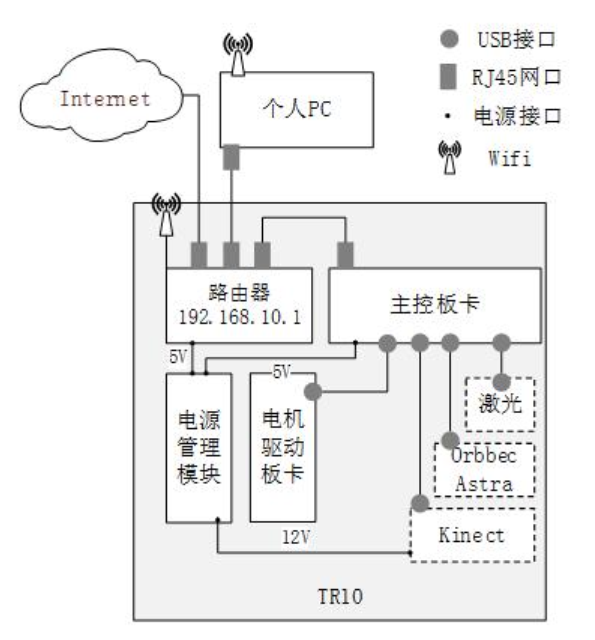

## Abel 移动机器人开发学习平台

Abel 是济南汤尼机器人科技有限公司专为高校机器人教育打造的一款高性价比的移动机器人开发学习平台，可以帮助高校打造机器人专业的课程，使学生系统的学习移动
机器人相关的内容。

Abel 采用二轮差速结构，搭载无线路由器、装有 ROS（ Robot Operation System，机器人操作系统）的主控板卡、 TRD05 电机驱动、电源管理模块，并支持激光雷达、深
度相机的接入（这里将会使用镭神 ls01d 激光雷达，奥比中光 Orbbec Aatra 深度相机）。另外， Abel 具有开源、免费的软件开发包，提供电机驱动、激光雷达驱动、深度相机驱
动、建图算法、导航避障算法等代码。

Abel 模块关系如图所示：

